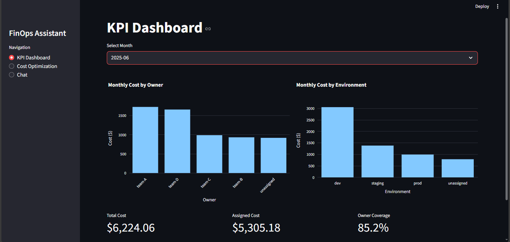
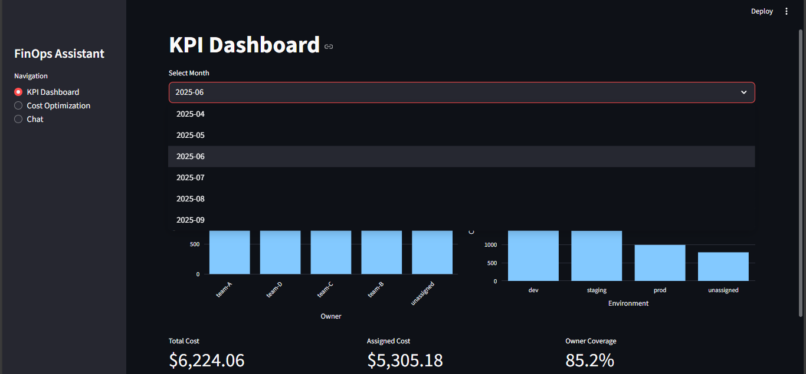
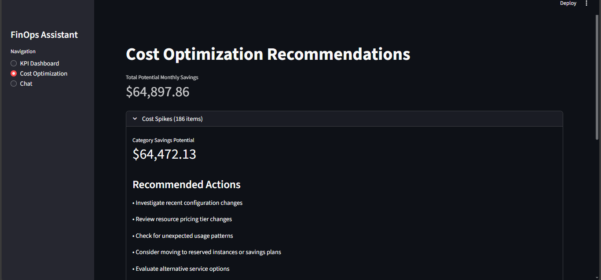
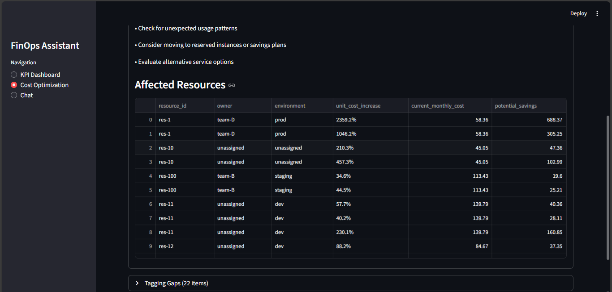
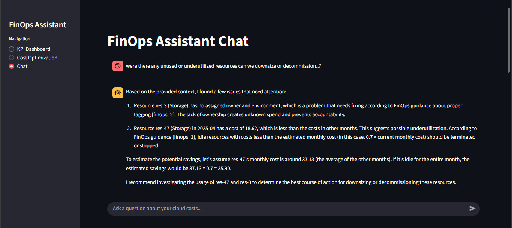
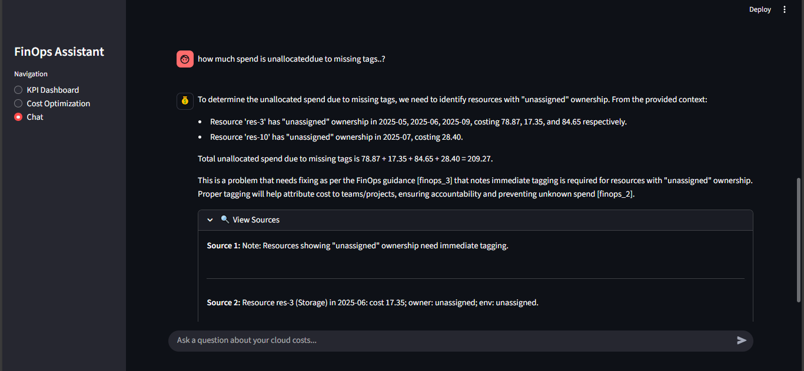

# 🌩️ AI-driven Cloud Cost Copilot (FinOps Assistant)

---

## 📌 Overview
**The FinOps Assistant is an AI-driven cloud cost analytics platform designed to help organizations monitor, analyze, and optimize their cloud spending.**
It provides:
- End-to-end pipeline: ETL → KPIs → RAG → Recommendations → API → UI
- KPI dashboards to analyze cost trends
- Natural-language Q&A over your cost data and FinOps documentation
- Actionable recommendations to reduce costs
  
---

## 🧩 Features

- Cost Analysis — Monthly spend trends, top cost drivers, cost anomalies
- RAG Q&A — Ask natural questions like “Why did compute cost increase in May?”
- Recommendations — Detect idle resources, tagging gaps, sudden spikes
- UI + API — Interactive Streamlit dashboard + FastAPI backend
- Evaluation Suite — Measure retrieval quality (Recall@k) + answer quality

---

## 🧠 Architecture
  

 ---

 ## 🗂️ Directory Structure
 
 ```
├── app/
│   ├── main.py             # FastAPI backend entrypoint
│   ├── models.py            # SQLAlchemy schema (billing, resources)
│   ├── analytics.py         # KPI & trend calculations
│   ├── rag.py               # RAG pipeline setup (retriever + LLM)
│   ├── etl.py               # ETL piepline to validate data
|   ├── reccomendations.py   # Suggestions Generation
|   ├── rag_qa.py            # LangChain QA chain logic
│   └── validators.py        # input validation, prompt-injection guard 
|                        
├── docs/                     # Project documentation
│   ├── finops.md             # Refernce Docs for LLM
│   ├── PRD.pdf               # Product requirement Document
│   ├── Technical Design doc.pdf
│   ├── Assets/              
|
├── UI/
│   └── app.py                # Streamlit frontend dashboard
├── scripts/
│   ├── ingest_billing.py
│   ├── seed _resources.py
│   ├── build_faiss_index.py
│   ├── update_assignments.py
|   ├── manage_data.py
│   └── ...
|
├── tests/                    # Testing Files for evaluation
│   ├── conftest.py
│   ├── evaluate_rag.py
│   ├── test_analytics.py
│   ├── test_reccomendations.py
|   ├── test_reccomendations_api.py
│   └── rag_eval_results.json
|
|
├── data/                     # SQLite DB (billing.db) & Data Files
├── requirements.txt
├── Dockerfile
├── docker-compose.yml
├── .dockerignore
├── .env.example
└── README.md

```
---

## ⚙️ Tech Stack

| Layer         | Technology                                                    | Purpose                       |
| ------------- | ------------------------------------------------------------- | ----------------------------- |
| ETL & DB      |Python, SQLAlchemy, SQLite                                     | Data ingestion + schema       |
| Analytics     |     Pandas, SQL                                               | KPI & cost trend calculations |
| RAG Pipeline  | sentence-transformers, FAISS, LangChain, Groq LLM             | Natural-language Q\&A         |
| API Layer     |    FastAPI                                                    | Serve KPIs and Q\&A endpoints |
| Frontend      |             Streamlit                                         | Interactive dashboard UI      |
| Deployment    | Docker, Docker Compose                                        | Containerization              |
| Observability | LangSmith                                                     | Logging + traces              |
| Security      | Prompt-injection guards, keyword filters                      | Secure LLM input              |


---

## 🧪 Setup & Running Locally

1. **Clone repo**
   ```bash
   git clone https://github.com/jasoncobra3/FinOps-Copilot.git
   cd FinOps-Copilot

2. **Create environment**
   ```bash
   python -m venv .venv
   source venv/bin/activate  # or venv\\Scripts\\activate (Windows)

3. **Install dependencies:**
   ```bash
   pip install -r requirements.tx

4. **Initialize DB**
   ```bash
     python -m app.models

5. **Generate Sammple Data**
   ```bash
   python scripts/generate_sample_data.py

7. **Ingest sample data**
   ```bash
   python scripts/ingest.py  --input data/sample_billing.csv
   python scripts/seed_resources.py
   python scripts/update_assignments.py ##generate randomness in data

9. **Build RAG index**
   ```bash
   python scripts/build_faiss_index.py

10. **Run FAstAPI Backend**
    ```bash
    uvicorn app.main:app --reload
    
- FastAPI - http://localhost:8000
    
12. **Run Streamlit Frontend**
    ```bash
    streamlit run UI/app.py
     
- Streamlit - http://localhost:8501
    
---

## 📊 Evaluation

**Run RAG retrieval evaluation**
  ```bash
     python tests/eval_rag.py
  ```
- Outputs Recall@1/3/5 scores in CSV
- Also includes answer quality scores (1–5 rubric)

---
## 🧠 Design Decisions & Trade-offs

- SQLite chosen for local simplicity, can migrate to PostgreSQL later
- FAISS is fast and lightweight for demo scale (vs hosted vector DBs)
- LangChain simplifies orchestration but adds abstraction → documented clearly
- Streamlit is quick to build for MVP, though not production-grade
- Groq LLM chosen to avoid dependency on paid APIs

---

## 🚀 Future Work

- Migrate to PostgreSQL for multi-user deployments
- Add real billing data ingestion from cloud APIs
- Implement cost optimization engine (idle resource detection, right-sizing)
- Add user auth + role-based access control
- Enhance Streamlit UI (filters, charts, reports)
- Deploy on Railway or Render with CI/CD

---

## 📸 Screenshots
| Dashboard KPI View| Month DropDown | Reccommendations |
|----------------|------------|---------------|
|  |  | |

| Underutilized resources| AI RAG Chatbot | Response With Resource group |
|----------------|------------|---------------|
||  |  |

---
## 🌟 Contributing
**Feel free to fork, star, or submit a pull request to contribute improvements!**


